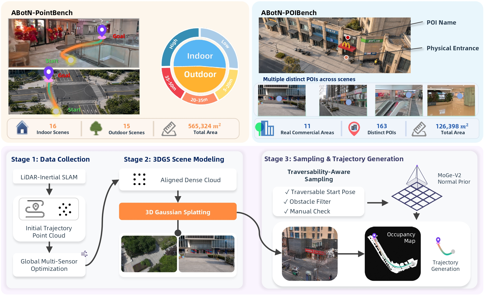

<div align="center">

# ABotN-Bench

[](https://arxiv.org/abs/2607.10383)
[](https://arxiv.org/pdf/2607.10383)
[](https://amap-cvlab.github.io/ABot-Navigation/ABot-N1/)
[](LICENSE)
[](https://huggingface.co/acvlab)
[](https://www.modelscope.cn/organization/amap_cvlab)

[English](README.md) | [中文](README_zh-CN.md)

</div>

我们基于同一套高保真 3D Gaussian Splatting (3DGS) 重建体系引入两个互补的评测基准——面向坐标导航的 **ABotN-PointBench** 和面向语义 POI 导航的 **ABotN-POIBench**——以推动真实室内外环境中闭环、社会规则感知的视觉导航评测。同时开源隔离物体识别与接近阶段的 **Short-Horizon OVON** 变体。所有基准及配套评测工具作为 [ABot-N1](https://arxiv.org/abs/2607.10383) 项目的一部分发布。

<p align="center">
  
</p>

## 基准数据集

| 基准 | 任务 | 目标 | 场景 | 评测集 |
|:-----|:-----|:-----|:-----|:-------|
| **ABotN-PointBench** | Point-Goal | 导航至 (x, y) 坐标 | 31 个真实 3DGS 场景（16 室内 + 15 室外） | 465 条轨迹 |
| **ABotN-POIBench** | POI-Goal | 导航至指定 POI 入口 | 11 个商业区域，12.6 万 m² | 163 个 POI |
| **Short-Horizon OVON** | Object-Goal | 识别并接近目标物体 | 36 个 HM3D 场景（OVON Val-Unseen） | 2,443 |

ABotN-PointBench 和 ABotN-POIBench 为本仓库新引入的基准，提供完整评测工具。Short-Horizon OVON 是 [HM3D-OVON](https://github.com/naokiyokoyama/ovon) 的可见性过滤变体，详见[说明文档](docs/zh-CN/short-horizon-ovon.md)。

## 📦 数据集——已开源

所有基准数据均已在 🤗 HuggingFace 和 🤖 ModelScope 上公开：

| 数据集 | 下载 |
|:-------|:---|
| ABotN-PointBench | [🤗 HuggingFace](https://huggingface.co/datasets/acvlab/ABotN-PointBench) \| [🤖 ModelScope](https://www.modelscope.cn/datasets/amap_cvlab/ABotN-PointBench) |
| ABotN-POIBench | [🤗 HuggingFace](https://huggingface.co/datasets/acvlab/ABotN-POIBench) \| [🤖 ModelScope](https://www.modelscope.cn/datasets/amap_cvlab/ABotN-POIBench) |
| ABotN-Short-Horizon-OVON | [🤗 HuggingFace](https://huggingface.co/datasets/acvlab/ABotN-Short-Horizon-OVON) \| [🤖 ModelScope](https://www.modelscope.cn/datasets/amap_cvlab/ABotN-Short-Horizon-OVON) |

下载与配置说明见[快速上手](docs/zh-CN/getting-started.md)。

**核心特性：**

- 基于真实 3DGS 场景重建的逼真多视角 RGB 观测
- 闭环评测，碰撞感知成功率指标（SR<sub>&lt;3col</sub> outdoor，SR<sub>&lt;1col</sub> indoor）
- 基于标注可行走性地图的社会规则感知通行性评分
- 标准化评测协议，固定阈值保证结果可比
- 极简 agent 接口：实现 `reset()` + `predict()` 即可评测任意模型

## 基准结果

### Point-Goal — ABotN-PointBench (Outdoor)

| 方法 | SR<sub>&lt;3col</sub>↑ | SPL↑ |
|:-----|:---:|:----:|
| GNM | 39.1 | 36.7 |
| ViNT | 62.2 | 62.2 |
| NoMaD | 56.0 | 55.7 |
| CityWalker | 48.9 | 48.3 |
| SocialNav | 72.0 | 71.9 |
| ABot-N1 | **92.9** | **91.4** |

### Point-Goal — ABotN-PointBench (Indoor)

| 方法 | SR<sub>&lt;1col</sub>↑ | SPL↑ |
|:-----|:---:|:----:|
| GNM | 26.7 | 26.6 |
| ViNT | 27.9 | 27.9 |
| NoMaD | 20.0 | 19.6 |
| CityWalker | 21.7 | 21.6 |
| SocialNav | 42.5 | 42.5 |
| ABot-N1 | **95.4** | **93.7** |

### POI-Goal — ABotN-POIBench

| 方法 | SR<sub>&lt;2m</sub>↑ | SPL↑ |
|:-----|:---:|:----:|
| ViNT | 19.0 | 18.2 |
| OmniNav (vanilla) | 23.9 | 22.4 |
| OmniNav (BridgeNav) | 34.4 | 31.5 |
| POINav | 42.3 | 40.3 |
| ABot-N1 | **77.3** | **72.6** |

### Object-Goal — Short-Horizon OVON

| 方法 | SR↑ | SPL↑ | DTG↓ |
|:-----|:---:|:----:|:----:|
| StreamVLN | 39.7 | 15.8 | 2.368 |
| NaVILA | 55.4 | 26.1 | 1.811 |
| Uni-NaVid | 68.7 | 34.5 | 1.495 |
| ABot-N1 | **84.9** | **51.8** | **0.822** |

> 完整结果与各难度分组详见[技术报告](https://arxiv.org/abs/2607.10383)。

## 架构

```
┌──────────────────────────┐         ┌──────────────────────────────┐
│  3DGS 渲染服务             │  HTTP   │  评测环境                      │
│  Python 3.8, CUDA 11     │◄───────►│  pip install abotn-bench     │
│  render_server/           │         │  import abotn_evaluator      │
└──────────────────────────┘         └──────────────────────────────┘
```

## 快速开始

```bash
# 安装
pip install abotn-bench

# 部署渲染服务（独立 conda 环境，需 CUDA 11）
conda env create -f render_server/environment.yml
conda activate abotn_render
bash scripts/start_PointGoal_outdoor_render_server.sh   # 先设置 SCENES_ROOT

# 评测
python -m abotn_evaluator.point_goal.runner \
    --agent-module your_agent:YourAgent \
    --data-dir /path/to/pointbench/outdoor/trajectory \
    --render-url http://localhost:7036/render_gs \
    --mode outdoor
```

## Agent 接口

```python
from abotn_evaluator.interface.point_goal import BasePointGoalAgent, Observation, WaypointPrediction

class YourAgent(BasePointGoalAgent):
    def reset(self): ...
    def predict(self, observation: Observation) -> WaypointPrediction:
        # observation.images: Dict[str, ndarray] — 多视角 RGB (left/front/right)
        # observation.target_position: ndarray — [front, left] 米
        # observation.distance_to_goal: float
        return WaypointPrediction(waypoint=..., arrive=...)
```

POI-Goal 使用 `BasePoiGoalAgent`，观测额外包含 `poi_name: str` 字段。

## 评测指标

| 任务 | 指标 | 说明 |
|:-----|:-----|:-----|
| Point-Goal (Outdoor) | SR<sub>&lt;3col</sub>, SPL | 3 次碰撞预算下的成功率；相对 A* 参考轨迹的路径效率 |
| Point-Goal (Indoor) | SR<sub>&lt;1col</sub>, SPL | 严格零碰撞成功率 |
| POI-Goal | SR<sub>&lt;2m</sub>, SPL | 2 m 内到达入口；全局及各 POI |
| Object-Goal (Short-Horizon OVON) | SR, SPL, DTG | 成功率、路径效率、终止时距目标距离 |

## 文档

| | |
|:--|:--|
| [快速上手](docs/zh-CN/getting-started.md) | 安装、渲染服务部署、数据下载 |
| [Point-Goal 评测](docs/zh-CN/point-goal.md) | Outdoor/indoor 协议与评测命令 |
| [POI-Goal 评测](docs/zh-CN/poi-goal.md) | POI-Goal 协议与评测命令 |
| [Short-Horizon OVON](docs/zh-CN/short-horizon-ovon.md) | 基于 Habitat-sim 的可见性过滤 Object-Goal 变体 |
| [API 参考](docs/zh-CN/api-reference.md) | 接口字段、坐标系、CLI 参数 |
| [自定义 Agent](docs/zh-CN/custom-agents.md) | 坐标适配、Wrapper 模式 |

## 引用

如在研究中使用 ABotN-Bench，请引用[技术报告](https://arxiv.org/abs/2607.10383)：

```bibtex
@misc{gong2026abotn1,
  title={ABot-N1: Toward a General Visual Language Navigation Foundation Model},
  author={Ruiyan Gong and Yingnan Guo and Junjun Hu and Jintao Kong and Xiaoxu Leng and Tianlun Li and Weize Li and Fei Liu and Zhicheng Liu and Jia Lu and Minghua Luo and Chenlin Ming and Yanfen Shen and Jiyue Tao and Zhengbo Wang and Mingyang Yin and Minqi Gu and Zihao Guan and Wei Guo and Guoqing Liu and Huachong Pang and Menglin Yang and Zeqian Ye and Xiaoxiao Geng and Zhining Gu and Honglin Han and Di Jing and Hongyu Pan and Mingchao Sun and Kuan Yang and Jianfang Zhang and Yanghong Chen and Ye He and Wei Mei and Jiahao Shi and Xiangpo Yang and Yanqing Zhu and Zedong Chu and Xiaolong Wu and Mu Xu},
  year={2026},
  eprint={2607.10383},
  archivePrefix={arXiv},
  primaryClass={cs.CV},
  url={https://arxiv.org/abs/2607.10383},
}
```

## 许可证

Apache-2.0。`render_server/` 保留 [3D Gaussian Splatting](https://github.com/graphdeco-inria/gaussian-splatting) 原始许可证。

## 致谢

ABotN-Bench 由 **AMAP CV Lab** 开发，是 [ABot-N1](https://amap-cvlab.github.io/ABot-Navigation/ABot-N1/) 项目的组成部分。感谢 [3D Gaussian Splatting](https://github.com/graphdeco-inria/gaussian-splatting)、[Habitat](https://aihabitat.org/) 和 [HM3D-OVON](https://github.com/naokiyokoyama/ovon) 等开源社区的贡献。
